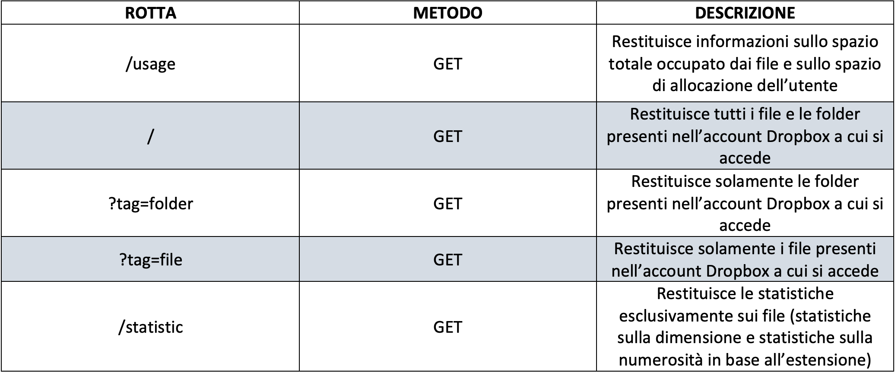

# ProgettoPAO
## Introduzione

L'applicazione presente nella repository, utilizzando le API (Application Programming Interface) di Dropbox, reperibili nell'apposita sezione di Dropbox dedicata agli sviluppatori (https://www.dropbox.com/developers/documentation/http/documentation), e mediante l'ausilio del framework SpringBoot, opera da Web Service.

Un WebService rappresenta un'interfaccia attraverso la quale due dispositivi possono comunicare tra loro mediante l'utilizzo del protocollo HTTP. In particolare questo consente ai clienti che si collegano mediante apposite applicazioni (in questo caso il browser) di usufruire di alcune funzioni messe a loro disposizione.

La finalità del presente progetto è quella di accedere ad un account Dropbox privato, tramite l'utilizzo di una chiave di accesso univoca (Bearer Token), analizzare le revisioni dei singoli file contenuti presenti ed effettuare sugli stessi alcune statistiche.

L'applicazione permette di richiedere mediante API REST (GET) con rotte distinte:
* Connessione al API;
* Restituzione dei dati (formato JSON);
* Restituzione delle statistiche sui dati (formato JSON);

### Tecnologie utilizzate
* GitHub
* SpringBoot
* Java
* Postman

## Funzionamento
### Avvio dell'applicazione
Una volta lanciata l'applicazione all'interno di un ambiente di sviluppo (IntellIJ), con JVM (Java Virtual Machine), compilatore e framework SpringBoot correttamente istallati sulla macchina, l'applicazione WebService sarà attiva e in ascolto alla porta: http://localhost:8080 .
### Richieste
Mediante richieste GET con rotte determinate, il client può richiedere determinati dati o statistiche.

## UML
### Class Diagram
Il diagramma delle classi fornisce una vista sulla struttura globale del progetto, rappresentando le varie classi e le interazioni tra le stesse.

### Use Case Diagram
Il diagramma dei casi d'uso riporta le funzioni che l'applicazione mette a disposizione dell'utente.

### Sequence Diagram
Il diagramma delle sequenze viene utilizzato per descrivere le azioni intese come successione di eventi. 
Esso mostra le varie azioni compiute dall'utente e dal sistema quando viene richiesto un determinato servizio, mostrando tutte le interazioni tra i due e tra eventuali sotto-sistemi.
* **getUsage()**
    

    
   Viene effettuata la richiesta GET al WebService e quest'ultimo effettua una richiestra POST all'API di Dropbox per richiedere l'utilizzo dati.

* **getAllFiles**

    
   Viene effettuata la richiesta GET al WebService e quest'ultimo effettua una richiesta POST all'API di Dropbox per richiedere l'elenco di tutti i file e folder.
    
* **getStatistics()**

    
   Viene effettuata la richiesta GET al WebService e quest'ultimo effettua una richiesta POST all'API di Dropbox e l'oggetto restituito viene passato per poi istanziare la classe Statistic che calcola tutte le statistiche e le restituisce.

