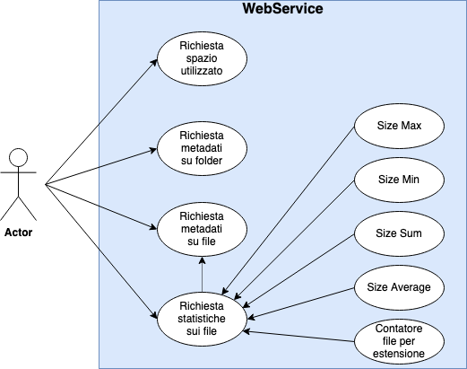

# ProgettoPAO
## Introduzione

L'applicazione presente nella repository, utilizzando le API (Application Programming Interface) di Dropbox, reperibili nell'apposita sezione di Dropbox dedicata agli sviluppatori (https://www.dropbox.com/developers/documentation/http/documentation), e mediante l'ausilio del framework SpringBoot, opera da Web Service.

Un WebService rappresenta un'interfaccia attraverso la quale due dispositivi possono comunicare tra loro mediante l'utilizzo del protocollo HTTP.In particolare questo consente ai clienti che si collegano mediante apposite applicazioni (browser, Postman, ecc.) di usufruire di alcune funzioni messe a loro disposizione.

La finalità del presente progetto è quella di accedere ad una cartella Dropbox privata, tramite l'utilizzo di una chiave di accesso (token), analizzare le revisioni dei singoli file contenuti in essa ed effettuare sugli stessi statistiche su numerosità e tempi medi.

L'applicazione permette di richiedere mediante API REST (GET) con rotte distinte:
* Connessione al API;
* Restituzione di dati (formato JSON);
* Restituzione di statistiche sui dati (formato JSON) e in particolare statistiche sulle revisioni per singolo file con numero di revisioni giornaliere e settimanali e tempo medio tra le revisioni;

### Tecnologie utilizzate
* GitHub
* SpringBoot
* Java
* Postman

## Funzionamento
### Avvio dell'applicazione
Una volta lanciata l'applicazione all'interno di un ambiente di sviluppo (IntellIJ), con JVM (Java Virtual Machine), compilatore e framework SpringBoot correttamente istallati sulla macchina, l'applicazione WebService sarà attiva e in ascolto alla porta: http://localhost:8080 .
### Richieste
Mediante richieste GET con rotte determinate, il client può richiedere determinati dati o statistiche.

* **Restituzione dei dati**:

* **Possibili statistiche**:

## UML
### Class Diagram

### Use Case Diagram
Riporta le funzioni che l'applicazione mette a disposizione dell'utente.

### Sequence Diagram

* **getUsage()**
    

    
    Viene effettuata la richiesta GET al WebService e quest'ultimo effettua una richiestra POST all'API di Dropbox per richiedere l'utilizzo dati.

* **getAllFiles**

    
    Viene effettuata la richiesta GET al WebService e quest'ultimo effettua una richiesta POST all'API di Dropbox per richiedere l'elenco di tutti i file e folder.
    
* **getStatistics()**

    
    Viene effettuata la richiesta GET al WebService e quest'ultimo effettua una richiesta POST all'API di Dropbox e l'oggetto restituito viene passato viene usato per istanziare la classe Statistic che calcola tutte le statistiche e le restituisce.

